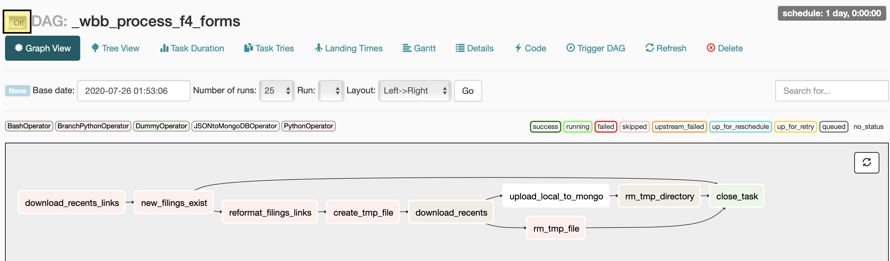
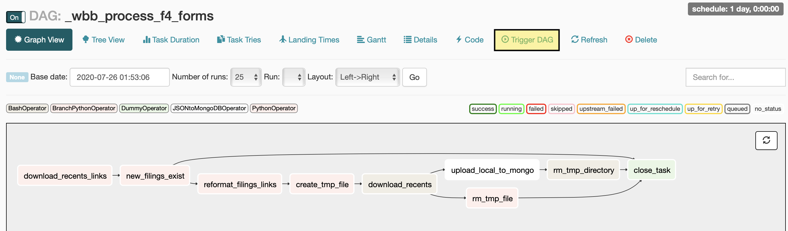

# Sample Airflow Pipeline

Project uses Airflow, PostgreSQL, and MongoDB to record all recent Form 4 filings fromm the SEC. The result of each run of this pipeline is new filings being added to our MongoDB instance.

## Setup

All pipelines are run in conntainers and managed via `docker-compose` (see: `docker-compose.yml`). Project consists of services. Note that we'll use PostgreSQL only as a backend for Airflow communication. PostgreSQL could be our main databaase, but given that these filings are saved as documents w. variables keys, a doc based DB is better fit.

To run a local version of this pipeline you should clone this repo and ensure that `docker-compose` is available on your machine. You can follow these [instructions](http://google.com) if you're new to Docker or need a fresh install.

After cloning this repo we should generate an encryption key for our Airflow instance. This is not strictly required, but a good practice to secure api keys, passwords, etc. If you have python available on your host machine you can run: `python3 -m utils.crypto.generate_key` from the root of this repo to generate a new Fermet key.

## Use

1. From the root of this repo, build the three services specified in our `docker-compose.yml`. During this stage we're installing pulling all depenencies required for each service from docker hub. The first build will take ~5 minutes or so, subsequent builds will be much faster.

    ```bash
    docker-compose up --build
    ```

2. Wait for build to finish, check that services are available by running `docker ps`, expect a result like the following:

    ```bash
    $ docker ps

    CONTAINER ID        IMAGE                        COMMAND                  PORTS                                        NAMES
    817831a2c530        dwilson/docker-wbb-airflow   "/entrypoint.sh webs…"   5555/tcp, 8793/tcp, 0.0.0.0:8081->8080/tcp   wbb_airflow_airflow_1
    0dee7ca7d6b4        mongo:latest                 "docker-entrypoint.s…"   27017/tcp                                    wbb_airflow_mongo_1
    ```

3. The Airflow UI is exposed from the container out to host machine. Type `http://localhost:8081/admin/` into a browser and the Airflow UI should appear.

4. Activate the DAG. From the UI you can turn on a DAG by clicking on the DAG and then the button highlighted in the image below. You can also trigger the DAG by using `docker exec` to send a comandd into the airflow container.

    

    OR

    ```bash
    # To Exec into the container and send airflow unpause
    docker exec -ti wbb_airflow_airflow_1 bash -c "airflow unpause _wbb_process_f4_forms"
    ```

5. Run the DAG (it may not run automatically on unpause). From the UI you can run the DAG by clicking the button highlighted in the image below. You can also trigger the DAG with `docker exec` and the airflow cli. Although docker tasks should be scheduled, the cli has the advantage of offering tools to manuallt 

    

    OR

    ```bash
    # To Exec into the container and tell airflow to run the pipeline for the current date
    docker exec -ti wbb_airflow_airflow_1 bash -c "airflow trigger_dag _wbb_process_f4_forms -e 07-25-2020"

    # To Exec into the container and tell airflow to backfill tasks.
    # Be careful with huge backfills! The Airflow scheduler (esp. running locally) is not meant to handle many tasks at a time
    docker exec -ti wbb_airflow_airflow_1 bash -c "airflow backfill _wbb_process_f4_forms -s 07-25-2020 -e 08-01-2020 -t close_task"
    ```

6. Check that our data hit mongoDB by making a sample query. You can exec into the airflow container and use the mongo shell that's been installed there to try some sample queries
    
    ```bash
    # Exec into the Mongo shell
    docker exec -ti wbb_airflow_airflow_1 bash -c "mongo --host=wbb_airflow_mongo_1"

    # Try a sample query, be sure to run `use filings` to connect to the 
    # DB the pipelines writes to.

    # How many total docs do we have?
    > db.ownership.count({})

    # Let's take a look at the first filing in the db.
    > db.ownership.find({}).limit(1)

    # Which companies had executives recently file an inside trade?
    > db.ownership.distinct('ownershipDocument.issuer.issuerName')
    ```
